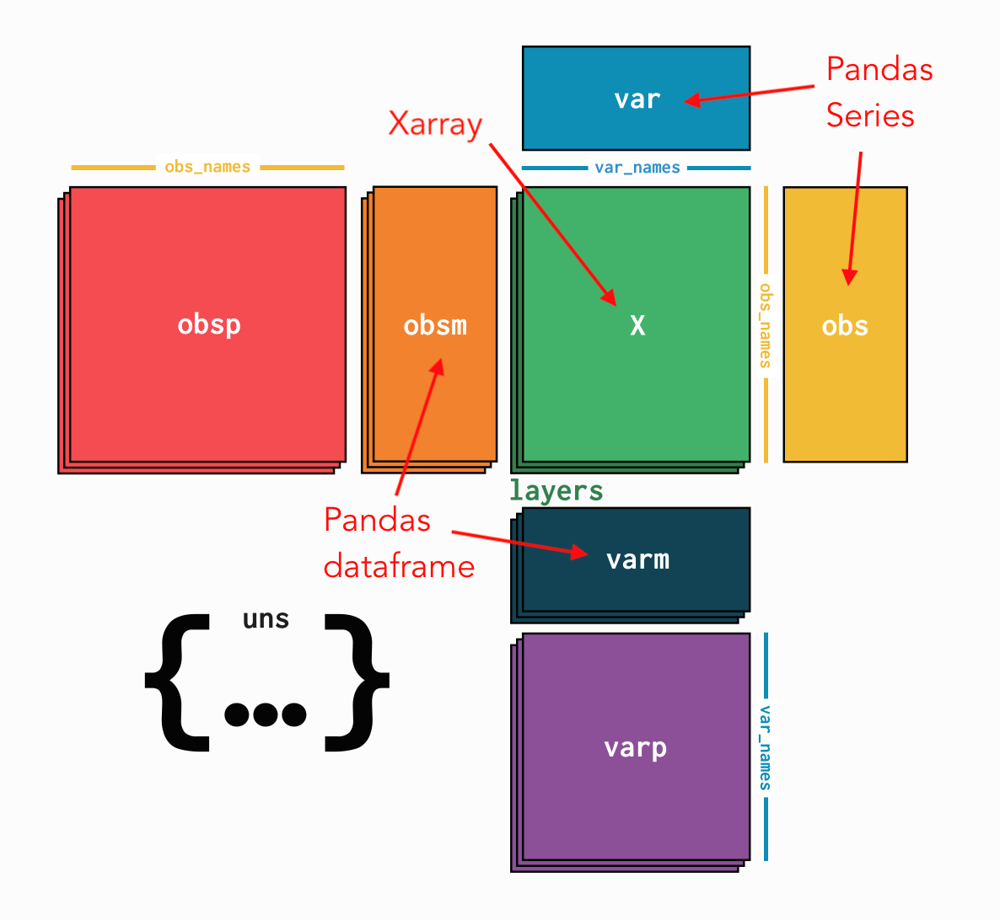

# Update on Anndata Extension

Qi An
2022.12.22

---

---

# Task

- Add support for genomic ranges based operations
  - Coordinates: (chromosome, start, end, *args)
  - Slicing with a given coordinate
  - Subset by overlap with a list of coordinates
  - Groupby and aggregation

---

# PyRanges

- https://github.com/biocore-ntnu/pyranges
- Nested containment list
  - List of dataframes, for each chromosome and strand
- Provide internal support for overlapping, intersection, etc.
- Drawback:
  - Not serializable, cannot be saved into `h5ad` data type
  - Immutable indexing 

---

# Wrapper around AnnData
