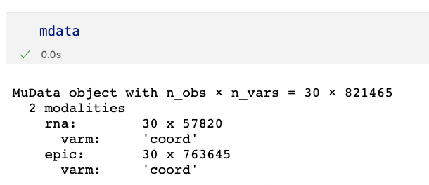
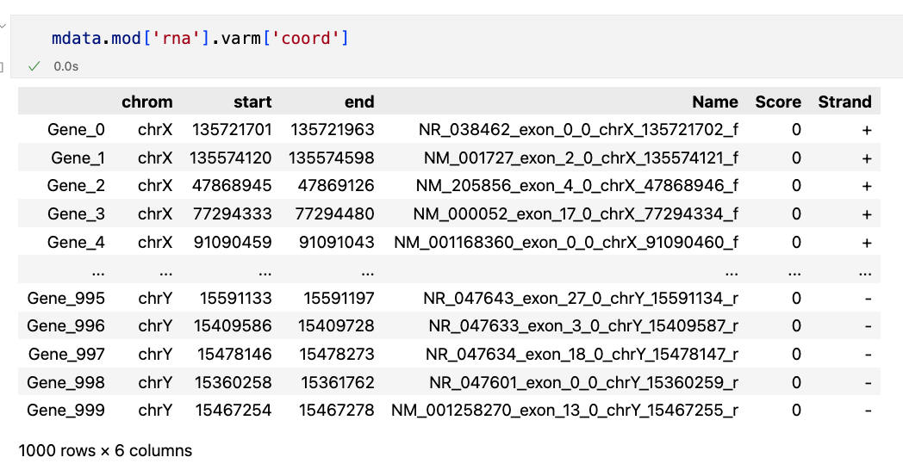
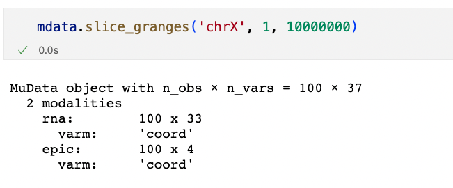
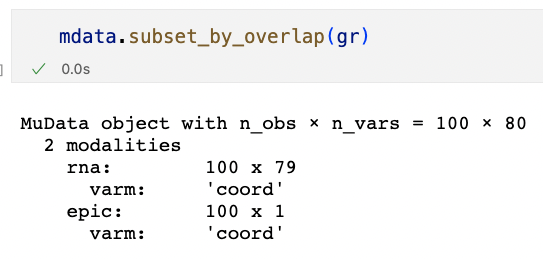
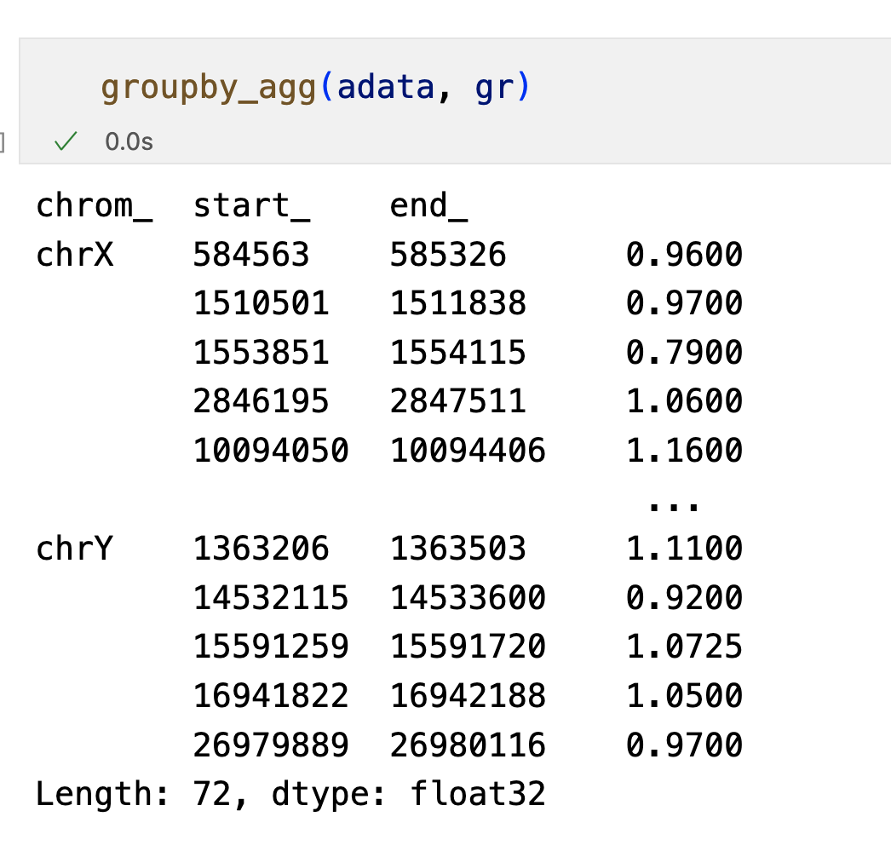
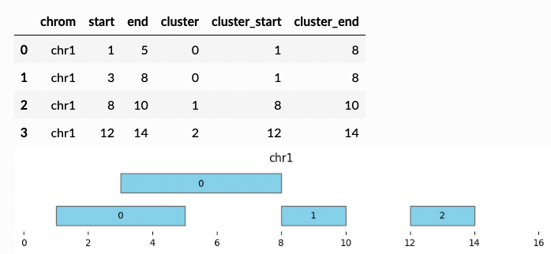

<!-- _class: lead -->

# Genomic ranges support in `AnnData` and `MuData`

Qi An
2023.04.18

---
<!--_header: Set coordinates as `varm`-->

---
<!--_header: Slice on Coordinates/Subset by overlapping with granges object-->

---
<!--_header: Groupby aggregation of each grange in given list-->

---

<!--_header: Problems and outlook-->

- Exportation: `h5ad` doesn't support serialization of categorical variables; chromosome data cannot be exported
- Cross layer analysis
- Peak analysis: For DMR and ATAC seq, peaks called from each sample not overlapping. 

